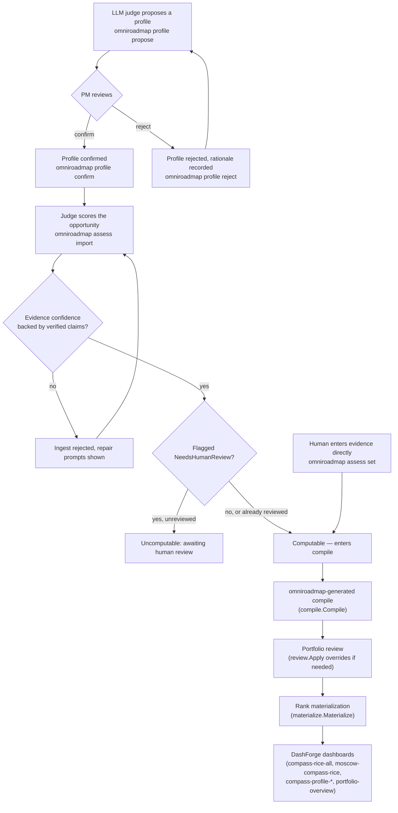

# COMPASS-RICE Prioritization

omniroadmap adopts [compass-rice](https://github.com/ProductBuildersHQ/compass-rice)'s
COMPASS-RICE methodology to solve a problem the [prism-roadmap](https://github.com/grokify/prism-roadmap)
ladder-based RICE score can't: a single 0..1 Reach fraction isn't
comparable across a portfolio that mixes customer features, platform
investments, risk mitigations, and cost optimizations. COMPASS-RICE
normalizes each of six investment-thesis profiles (Customer, Platform,
Market Expansion, Operational Efficiency, Supportability, Risk) — each
with its own domain-specific evidence model — into the same canonical
Reach/Impact/Confidence/Effort shape, so the resulting score is comparable
portfolio-wide regardless of which profile produced it.

omniroadmap's own ranking pipeline is **compass-only**: an opportunity
without a PM-confirmed COMPASS profile is excluded from ranking with an
explicit reason, never silently scored on the legacy ladder scale (the two
Reach regimes — 0–100 banded vs. 0..1 fraction — are numerically
incompatible). The legacy ladder RICE API still exists in prism-roadmap
for other consumers; omniroadmap's `compile` package just never falls back
to it.

## Two-phase scoring: LLM proposes, PM confirms

Every score traces back to a **primary investment thesis** — exactly one
profile, confirmed by a human, before its score counts toward ranking
(compass-rice PRD D5: never run competing profiles to produce competing
scores).



`profile propose`/`confirm`/`reject` and `assess import`/`set` are
independent steps — an opportunity can have its profile confirmed before
or after it's actually scored, and its MoSCoW tier ([`omniroadmap moscow`](cli.md))
is assessed on its own timeline entirely. `compile` is the single place
all three come together into a rank.

## The compile-time gate

`compile.Compile` (via `gateRankInput`) enforces the two-phase gate on
every opportunity in the current assessment corpus, independent of what
`ToRankInput` alone would resolve:

| Assessment state | Result |
|---|---|
| No `Compass` assessment recorded | Uncomputable: *"awaiting COMPASS assessment"* |
| `Compass` recorded, but no matching confirmed `ProfileAssignment` | Uncomputable: *"COMPASS profile not confirmed by PM"* |
| `Compass` recorded, `NeedsHumanReview` set, no `HumanReview` cycle yet | Uncomputable (via `ResolveCompassRICE`) |
| `Compass` recorded and confirmed | Computable — ranked by MoSCoW tier, then COMPASS-RICE score |

Excluded opportunities are never dropped — they come back with their
reason, exactly like `assessment.RankingPolicy`'s existing `ExclusionWont`/
`ExclusionRICEUncomputable` handling. `omniroadmap assess list` surfaces
this directly: `computable`, `needs-review`, `uncomputable`, or
`no-compass`.

## The confidence integrity check

`compassbridge.Ingest` never trusts a judge's self-reported confidence.
compass-rice's `Normalizer` derives a Confidence tier from the evidence
struct's self-reported source counts (`verifiedQuantitativeSources`,
`verifiedQualitativeSources`); `provenance.Confidence` derives a Confidence
tier independently from the judge's actual verified `claims.Claim` list.
If the evidence-derived tier exceeds the claims-derived tier — the
evidence claims more confidence than its citations actually support —
`Ingest` rejects the assessment and surfaces `RepairPrompts()` from any
reason codes attached to the judge's rubric categories.

`omniroadmap assess set` (the human-entered path) skips this check
entirely: a human who typed the evidence themselves is trusted at face
value, and the resulting assessment is marked already human-reviewed.

## Scoring an opportunity end to end

```bash
# 1. LLM proposes the profile (judge identity via --by)
omniroadmap profile propose --spec-id OPP-42 --profile customer/b2b/v1 \
  --rationale "primarily a retention play" --by claude-session-9

# 2. PM confirms it
omniroadmap profile confirm --spec-id OPP-42 --by pm@example.com

# 3a. Judge submits evidence + verified claims
omniroadmap assess import judge-output.json

# 3b. ...or a PM enters evidence directly (no judge output needed)
omniroadmap assess set --spec-id OPP-42 --profile customer/b2b/v1 \
  -f evidence.json --by pm@example.com

# 4. Check status
omniroadmap assess list --status computable
omniroadmap assess show OPP-42

# 5. Separately, resolve MoSCoW from evidence-backed ladder answers
omniroadmap moscow set OPP-42 --level must --criterion 1 \
  --rationale "KTLO: legacy dependency reaches EOL in Q4" --evidence EV-1
```

`judge-output.json` (the `assess import` document shape — deliberately
different from compass-rice's own `judge.Output` Go struct, which has no
JSON tags and is meant to be constructed in code, not parsed from a file):

```json
{
  "specId": "OPP-42",
  "title": "Self-service SSO",
  "profileId": "customer/b2b/v1",
  "evidence": {
    "eligibleAccounts": 40,
    "affectedAccounts": 12,
    "eligibleArr": 10000000,
    "affectedArr": 3500000,
    "expectedRetentionOrExpansionImprovementPp": 2,
    "verifiedQuantitativeSources": 2,
    "verifiedQualitativeSources": 1,
    "effortPd": 20
  },
  "claims": [
    {"id": "c1", "text": "affected ARR is $3.5M", "category": "metadata",
     "verdict": "verified",
     "validation": {"type": "internal", "internal": {"method": "log-analysis"}}}
  ]
}
```

## Visualizing scores: DashForge dashboards

The whole dashboard surface is [DashForge](https://github.com/plexusone/dashforge)
DashboardIR, not a hand-rolled UI — omniroadmap's job is to be a
first-class analytics source (catalog + read-only GuardSQL query
execution) plus a curated dashboard pack, the same "app on a generic
engine" model Splunk's own SIEM started as. See [Analytics & Dashboards](analytics.md)
for the catalog datasets, query dispatch, and the four curated dashboards.

```bash
# Run the local UI + analytics API (serves /api/analytics/dashboards live)
omniroadmap ui

# Or export the pack for import into a standalone dashforge-server
omniroadmap analytics export-dashboards ./dashboards
```

## Design decisions worth knowing

- **No legacy fallback in `compile`.** `assessment.OpportunityAssessment.ToRankInput`
  (prism-roadmap's own library function) falls back to the legacy ladder
  RICE when `Compass` is nil, for consumers who haven't adopted COMPASS-RICE.
  omniroadmap's `compile.gateRankInput` deliberately does **not** — an
  opportunity without a confirmed COMPASS profile is uncomputable, full
  stop, never legacy-scored.
- **Cycle carry-forward.** `compassbridge.NextCycleWithCompass` and the
  CLI's `carryForwardNextCycle` (used by `moscow set`) both explicitly
  copy every other judgment field (MoSCoW answers, dimensions, OKR
  contributions, capability references) forward into a new cycle before
  overriding just the field that command changed.
  `assessment.OpportunityAssessment.NextCycle` itself only carries
  `Opportunity`/`Title`/`Cycle` forward by design — a cycle-producing
  command that skips this carry-forward step will silently drop unrelated
  judgment data.
- **Secondary profiles are never scored.** A `ProfileAssignment.Secondary`
  list records other profiles with real value for an opportunity ("this is
  primarily Platform, but also has Customer value") as context only —
  compass-rice's own integration guide is explicit that running a second
  Normalizer to produce a competing score reopens the score-shopping
  problem the primary-thesis rule exists to prevent.
