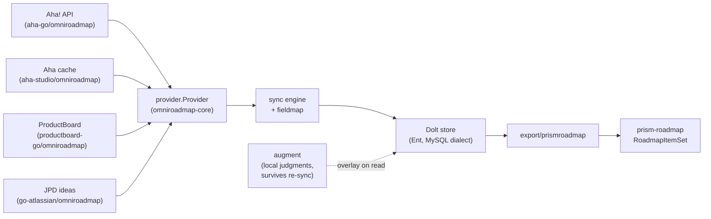

# omniroadmap

Tool-agnostic roadmap/product-management data for Go: one canonical
representation of features, epics, initiatives, releases, and objectives,
with pluggable providers for Aha!, ProductBoard, and Jira Product
Discovery — plus a Dolt-backed canonical store, per-tenant prioritization
mapping, and export into [prism-roadmap](https://github.com/grokify/prism-roadmap).

## Why

Every PM tool models roadmap data differently, and building anything on
top of one tool's shape (a UI, analytics, prioritization tooling) locks
you in. omniroadmap ingests each tool's native records through a small
`Provider` interface into common types, so downstream consumers — sync,
storage, export, visualization — are written once.

## The ecosystem

- **[omniroadmap-core](https://github.com/grokify/omniroadmap-core)** owns
  the contract: the `Provider` interface, canonical types (`Item`,
  `Release`, `Status`, `CustomField`, `RICE`, ...), the provider registry,
  and a `providertest` conformance suite every adapter runs.
- **Provider adapters** live inside each tool's SDK repo (the
  elevenlabs-go/opik-go embedded-adapter pattern), registered by name via
  `init()`.
- **This repo** bundles them (blank imports + type-alias re-exports) and
  adds the higher-level layers: `fieldmap`, `augment`, `store`, `sync`,
  `export/prismroadmap`, and the `omniroadmap` CLI.

## Design principles

- **Honest data**: fields a source doesn't provide stay unset. Imported
  items without MoSCoW/RICE remain unprioritized rather than defaulting —
  prism-roadmap's `RoadmapItem` accepts that (MoSCoW is optional as of
  v0.17.0).
- **Typed common core, JSON long tail**: fields shared across tools are
  typed on `Item`; provider-specific extras live in a namespaced
  `Metadata` map (e.g. `"aha.progress_source"`).
- **Provenance everywhere**: every canonical record keeps its `Provider`,
  `SourceID`, `SourceRef`, and `SourceURL`.
- **Sync overwrites, augments survive**: a re-sync replaces provider data
  (and anything derived from it via fieldmap) wholesale — the store always
  mirrors the source. Locally-authored judgments (MoSCoW, Kano, RICE
  overrides, OKR links, notes) live in a separate table keyed by source
  reference and are overlaid on read, never touched by sync. See
  [Augments](augment.md).

## Next steps

- [Getting Started](getting-started.md)
- [Providers](providers.md)
- [Fieldmap: mapping MoSCoW/Kano/RICE from custom fields](fieldmap.md)
- [Augments: local data that survives re-syncs](augment.md)
- [Store & Sync](store-sync.md)
- [prism-roadmap Export](export-prismroadmap.md)
- [CLI Reference](cli.md)
